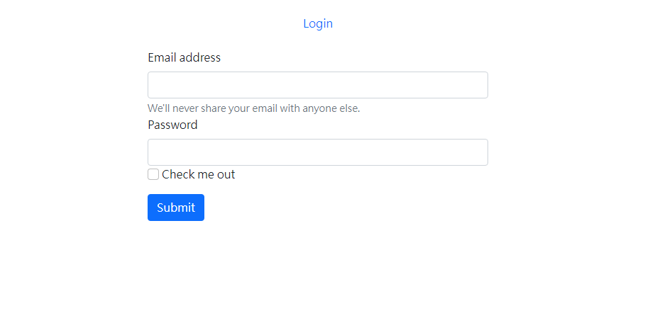

## Simple Login Web

## 介紹

- 簡單的登入網站，只能使用固定的email/密碼
- 測試用email/密碼於model.json中

## 功能
- 登入個人頁面

## 使用須知

1. 終端機需安裝 Node.js & npm 
2. clone專案至本地
3. 專案開啟後於，終端機輸入: npm install ，安裝package.json
4. 安裝完成後，輸入 npm run start
5. 看見 login is running on http:localhost:3000，表示順利運行，在瀏覽器輸入: localhost:3000 進入 
6. 若要退出 ctrl + c

## 使用工具

- Node.js 16.14.0
- Express 4.17.3
- Express-Handlebars 4.0.2
- Boostrap 5.1.3
- MongoDB 
- mongoose 6.2.7